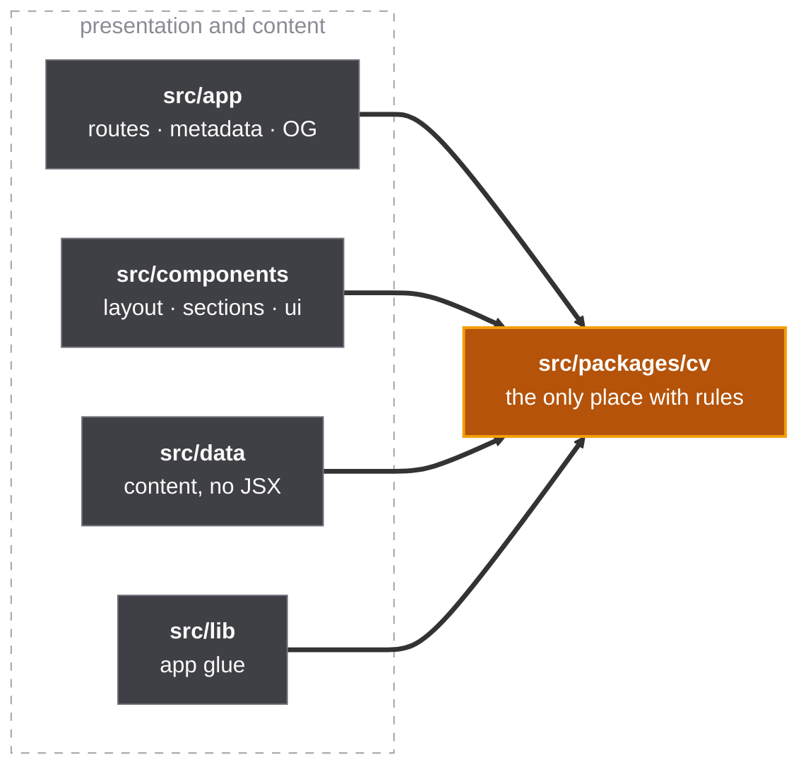

<p align="center">
  
</p>

<p align="center">
  
  
  
  
  
  
</p>

<p align="center">
  <i>A personal portfolio. Because apparently LinkedIn isn't enough anymore.</i>
</p>

---

## Architecture



Dependencies point inward, and `pnpm lint:boundaries` fails CI the day one doesn't. Architecture
diagrams should be executable, not aspirational.

No ports, no adapters, no repositories: it's a static site whose database is a TypeScript array.
There is nothing to decouple from, and a hexagon with one side is just a line.

## Structure

```
src/
├── app/           # routes, layout, OG image, SEO
├── components/    # layout · sections · ui
├── data/          # all content. no JSX allowed.
├── lib/           # glue between the content and the domain
└── packages/      # the domain. entry point at the root, internals private
```

## Commands

```bash
pnpm dev        # → http://localhost:3000
pnpm build      # → out/  (static, deploy anywhere)
pnpm verify     # what CI runs: lint, boundaries, types, unit, browser, a11y
pnpm lint:fix   # because the linter is always right
```

Conventions for humans and agents live in `AGENTS.md` and `.claude/rules/`.
